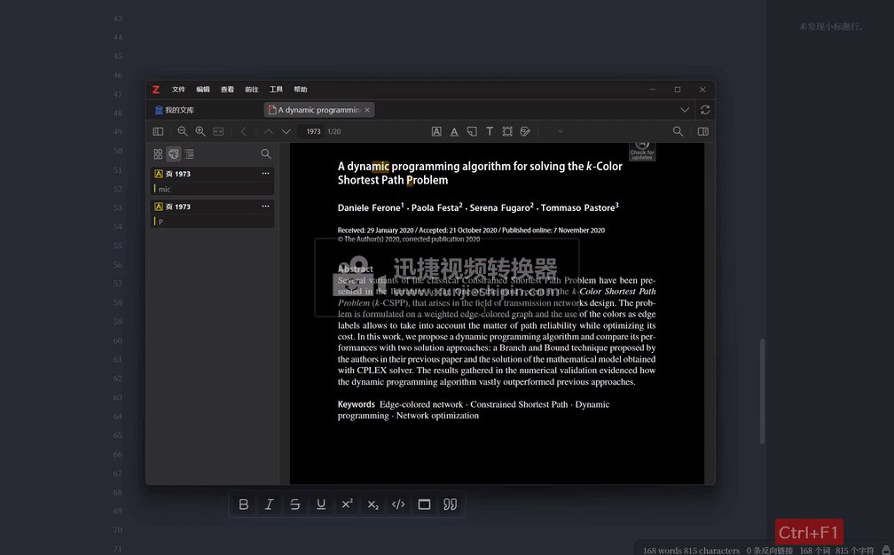

# Six-BackLink

知乎文字链接：[用Quicker复制6种软件的回链](https://zhuanlan.zhihu.com/p/690742341)

哔哩哔哩视频链接：无

## 用Quicker复制6种软件的回链

前6篇文章，我分别介绍了用Quicker实现BookxNote、Zotero、Eagle、PotPlayer、PowerPoint、Xmind的摘录动作。有一些时候，我们希望仅仅复制回链，其他东西比如文字、图片不需要，因此这篇文章介绍一下复制6种软件的回链。

BookxNote、Zotero、Eagle在安装软件时，会在注册表里注册回链。PotPlayer、PowerPoint、Xmind则需要自己添加注册表，可以看我之前的3篇文章。

该Quicker动作的原理，就是自动快捷键，获取需要的信息，如文件路径、时间戳等，然后将这些信息处理为回链，并写入剪贴板。

复制BookxNote回链：

复制Zotero回链：

复制Eagle回链：

复制PotPlayer回链：

复制PowerPoint回链：

复制Xmind回链：

制作Quicker动作的思路：

其中最下面的关于Xmind的标题看起来很奇怪，这是因为不同软件需要按的快捷键不同，因此需要识别当前是哪个软件，并按相应快捷键。但是当获取Xmind软件的窗口标题时，只能得到xmind文件的名称，因此无法直接判断当前软件时Xmind。只能用排除法，排序是其他软件的可能。

我将该Quicker动作、不同的摘录情况的调试运行详情放到了[github仓库](https://github.com/operations4304/Six-BackLink)

**但不幸的是，如果您直接用肯定是没法用的**。因为时间精力有限，没法做成普遍适用的动作。

所以这里提供的是实现的思路，以及可以参考的某些步骤的动作的写法。

到这，关于回链，我想介绍的就全部介绍完了。一共7篇文章，前6篇介绍具体软件摘录到Obsidian的思路，第7篇，即本篇，介绍复制6种软件的回链的思路。

大家完全可以自定义任何软件，使之带回链、可以跳转。

谢谢观看！

